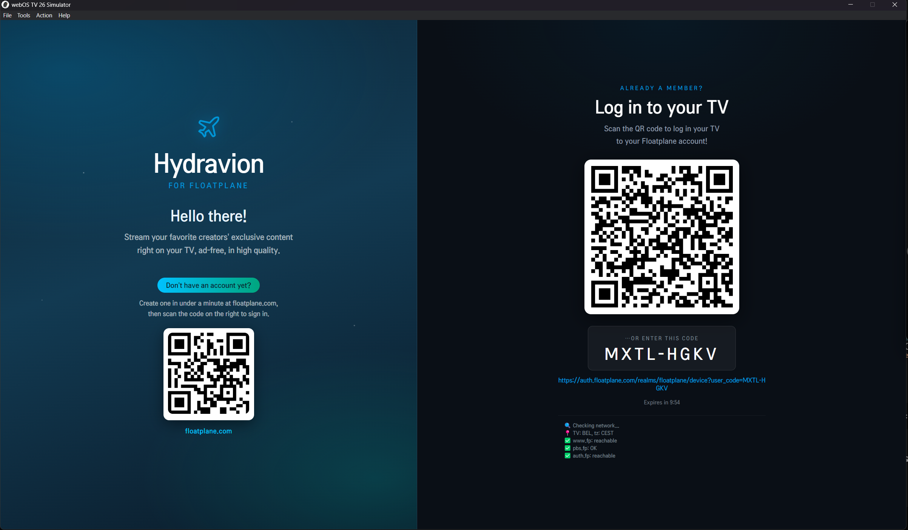
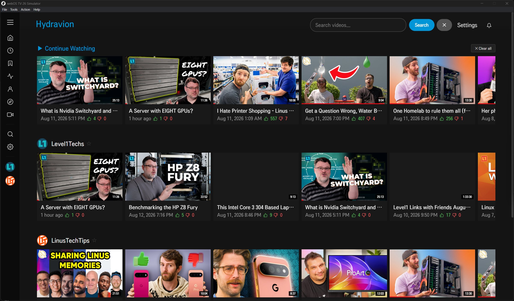
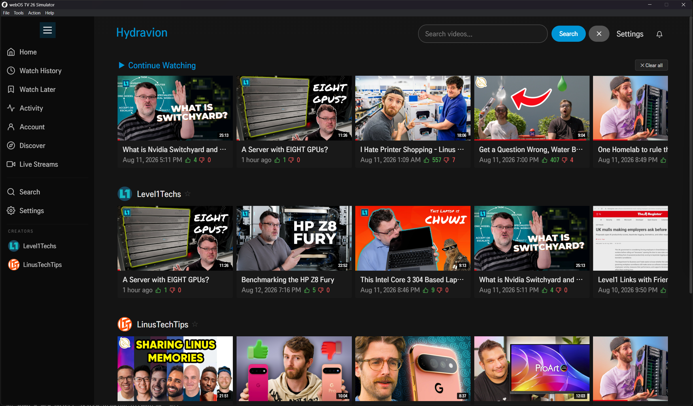
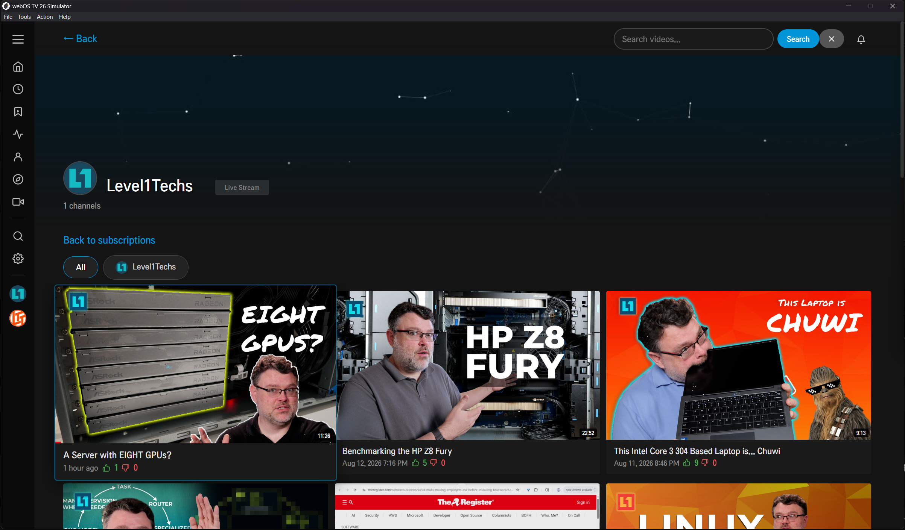
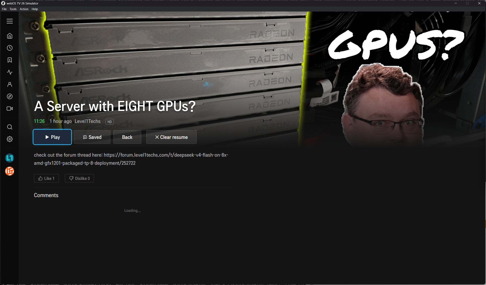
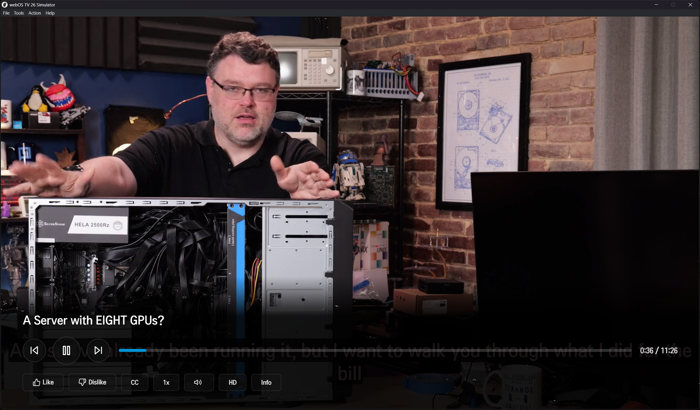

# Hydravion - WebOS

Unofficial Floatplane client for LG Smart TV (webOS). Floatplane-style UI.

## Screenshots

<p align="center">
  
  
  
  
  
  
</p>

## Guides

- **[How to use the app](docs/USAGE.md)** - a full user guide with screenshots
- **[Install on your LG TV](docs/INSTALL.md)** - developer mode, ares tools, and deploying

## Features

- **Device auth login** via QR code or OAuth link
- **Floatplane-style browse** with horizontal video rows per creator
- **Channel navigation** - browse subchannels per creator (e.g. "Channel Super Fun", "Techquickie")
- **Server-side search** using `?search=` param across subscriptions
- **Resolution picker** - choose quality before playback
- **Shaka Player** HLS/DASH playback with auto token refresh
- **Auto-refresh** on 401/403 with stored refresh token
- **Hydravion User-Agent** for Cloudflare compatibility

## What's New in 2.0

- Rows with gradient backgrounds, hero headers, smooth focus animations
- Channel/subchannel browser (click the 📂 Channels card on any creator row)
- Search bar in header (server-side search across all subscriptions)
- Resolution picker dialog before playback
- Auto-token refresh on 401/403
- Handles both delivery response formats (groups[] and cdn+urls)
- Fixed User-Agent to `Hydravion (AndroidTV 1.4.2)` for CDN/Cloudflare

## Build

```bash
# Linux / macOS
./build.sh

# Windows (PowerShell)
.\build.ps1
```

Output: `com.hydravion.tv_2.2.0_all.ipk` (plus `com.hydravion.tv_debug_2.2.0_all.ipk` / `com.hydravion.tv_release_2.2.0_all.ipk`) - produced by either script.

## Developer Deployment to LG TV

### Prerequisites

- LG TV with **Developer Mode** enabled
- webOS TV CLI tools (`ares-*`) - install via `npm i -g @webos-tools/cli`
- TV and dev machine on the same network

### Step 1: Enable Developer Mode on TV

1. Open the LG App Store on your TV
2. Search for **"Developer Mode"** app → install & open
3. Set a password and enable Developer Mode
4. Note the TV's IP address (Settings → Network → Wi-Fi Information)

### Step 2: Register Your Device

```bash
ares-setup-device -a tv
# Enter a name for the device (e.g. "my-lg-tv")
# Hostname or IP: 192.168.x.x
# Port: 9922 (default)
# Username: (whatever you set in Developer Mode app - often "lguser" or "developer")
# Password: (the password you set in Developer Mode)
```

### Step 3: Enable DevMode on TV for this session

```bash
ares-novacom -d tv --devicekey --open
```

Or toggle Developer Mode on the TV app to ensure it's active. A key icon in the TV status bar indicates it's connected.

### Step 4: Package the App

```bash
ares-package .
```

This creates `com.hydravion.tv_2.2.0_all.ipk`.

### Step 5: Install to TV

```bash
ares-install -d tv com.hydravion.tv_2.2.0_all.ipk
```

### Step 6: Launch

```bash
ares-launch -d tv com.hydravion.tv
```

Or find the app in your TV's app launcher.

### Update an Existing Install

```bash
ares-install -d tv --remove com.hydravion.tv
ares-install -d tv com.hydravion.tv_2.2.0_all.ipk
ares-launch -d tv com.hydravion.tv
```

### View Logs

```bash
ares-log -d tv com.hydravion.tv
```

### Inspect/Debug

```bash
ares-inspect -d tv com.hydravion.tv
```

Opens a Chrome DevTools remote inspector for live debugging.

## Project Structure

```
hydravion-webos/
├── appinfo.json          # App metadata (id, version, title)
├── index.html            # Main entry point
├── css/style.css         # Floatplane-style UI
├── js/
│   ├── api.js            # Floatplane API client + token auto-refresh
│   ├── app.js            # Main app logic (browse, search, channels, player)
│   └── player.js         # Shaka Player HLS wrapper
├── lib/
│   ├── shaka-player.compiled.js
│   ├── qrcode.js
│   └── spatial_navigation.js
├── webOSjs/              # webOS TV JS bindings
├── icon.png              # App icon
└── build.sh              # Build script
```
